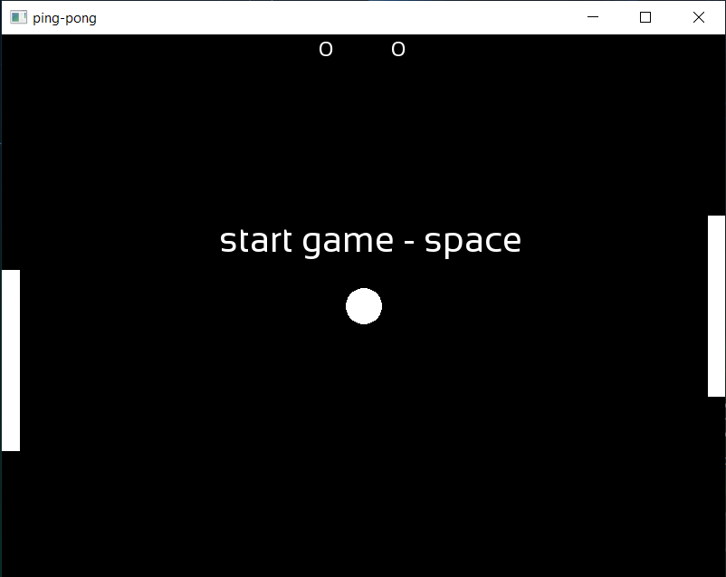

# PING-PONG GAME

## (ENG)

## Description

Hello, everyone. It's a my pet-project game.  
In this game you can play with your friend, cuz the game for two players.  
In game we have left player (left brick) and right player (right brick).  
Game has ball, which move right or left.  
When ball touches left or right brick, the ball is accelerating until it hits a brick.
When left or right score is 11 - game over.  

## Contributions

If you find a bug - create issue.  
If you want to improve this game - create fork and just do it (my code is not a best realization).

## Please

I'm a creator of this code and I was tearing my hair out while writing it.  
Thus, if you want to use this code - you can, but don't forget about that you didn't write this code.  
Let's just respect each other.  
Atari is cool.

## Screenshots

## (RU)

## Описание

Привет всем! Эта игра - мой пэт-проект.  
В эту игру вы можете играть с другом, потому что она на двоих.  
В игре у нас есть левый игрок (кирпичик слева) и правый игрок (кирпичик справа).  
Так же в игре есть мячик, который может двигаться вправо и влево.  
Каждый раз когда мячик ударяется об какой-нибудь из кирпичиков, он ускоряется до тех пор, пока не пробьёт одну из плиток.  
Когда счёт одного из игроков достигнет 11 - игра закончится.  

## Участие в проекте

Если вы найдёте баг - создайте об этом запись в проблемах\вопросах\ошибках.  
Если вы хотите улучшить игру - просто сделайте это (мой код - не лучшая реализация).

## Пожалуйста

Я написал этот код. И пока писал - повыдёргивал себе все волосы на голове.  
Поэтому, если вы хотите использовать его, то пожалуйста.  
Но не забывайте о том, что у него есть создатель.
Давайте просто уважать друг друга.  
Атари это круто.
